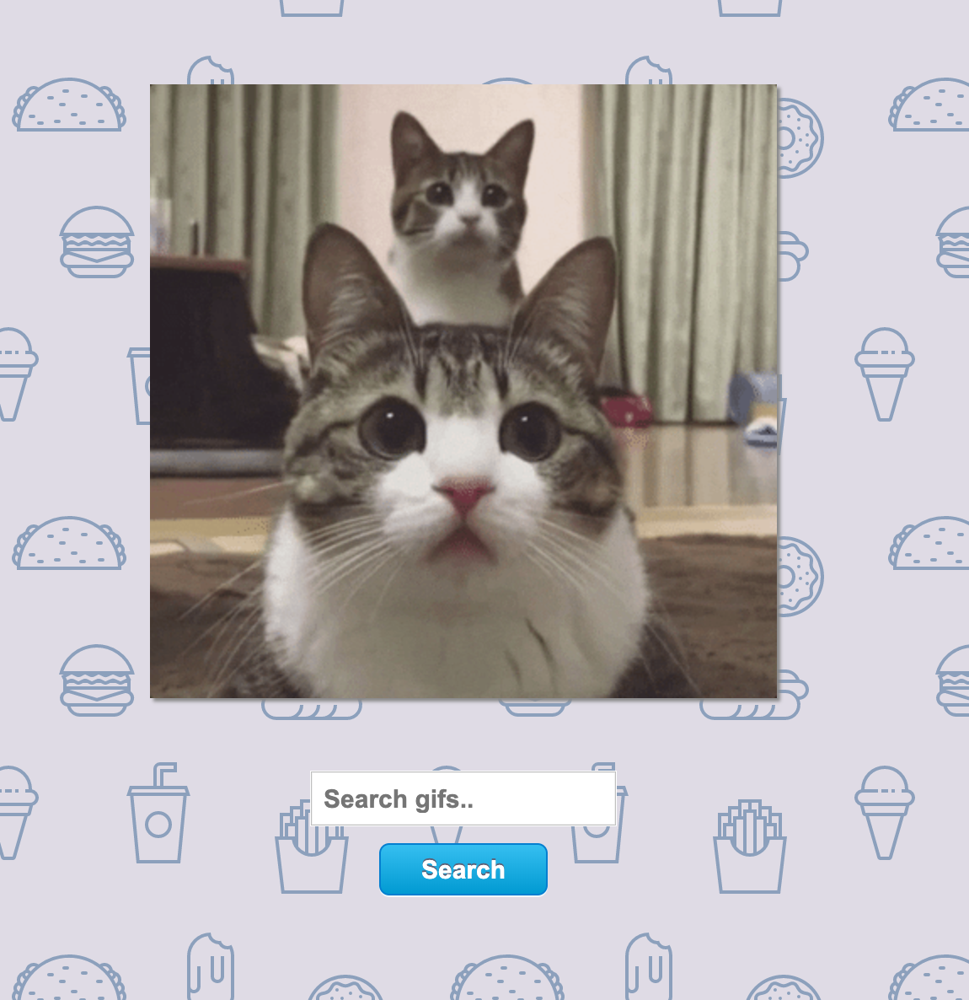

# Project: Fetch Cats

This is a quick and fun little project to demonstrate fetching dating from an API and working with asynchronous functions.
Our API in this case was [Giphy](https://giphy.com/) where all the fun animated memes live.

### [Fets Cats API Demo](https://winplam.github.io/fetch-cats/)

At first, a Promise was used to capture a JSON response from the Giphy API, a call which is performed asynchronously.
Promises are a great leap ahead of using callbacks for asynchronous operations because it helps to avoid what is affectionately known as callback hell. 

Later on, I refactored the code to use an Async function instead with a regular try/catch block.
Async is syntactic sugar for Promises that make asynchronous methods look more like synchronous code.
The main drawback of Async is that it can't be used in the global scope. 

## Screenshot

## JavaScript features used 
* Fetch (.then, .catch)
* Promises
* Async / Wait
